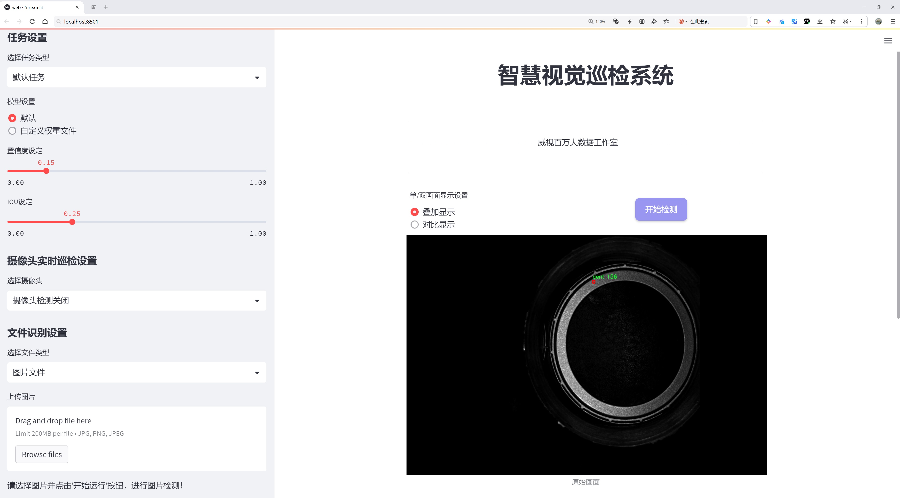
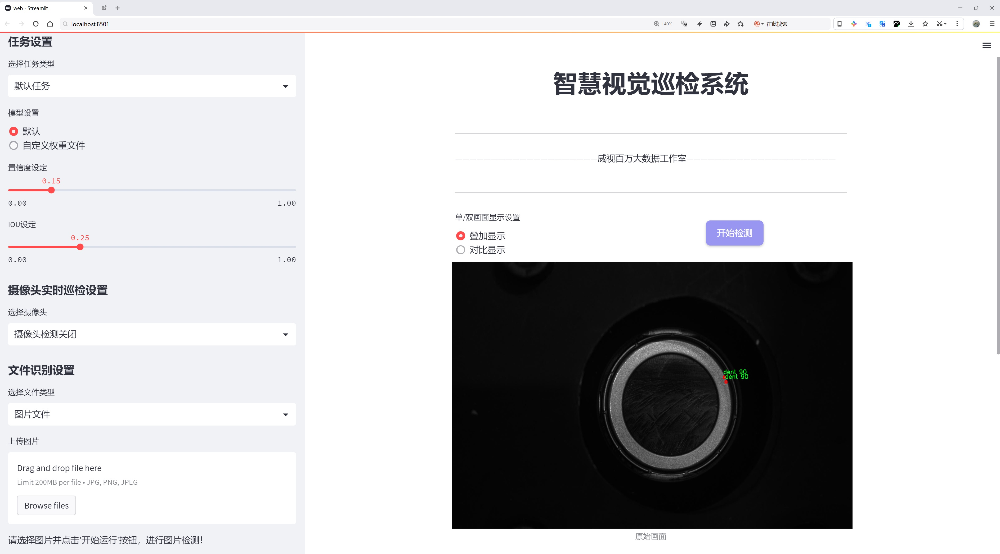
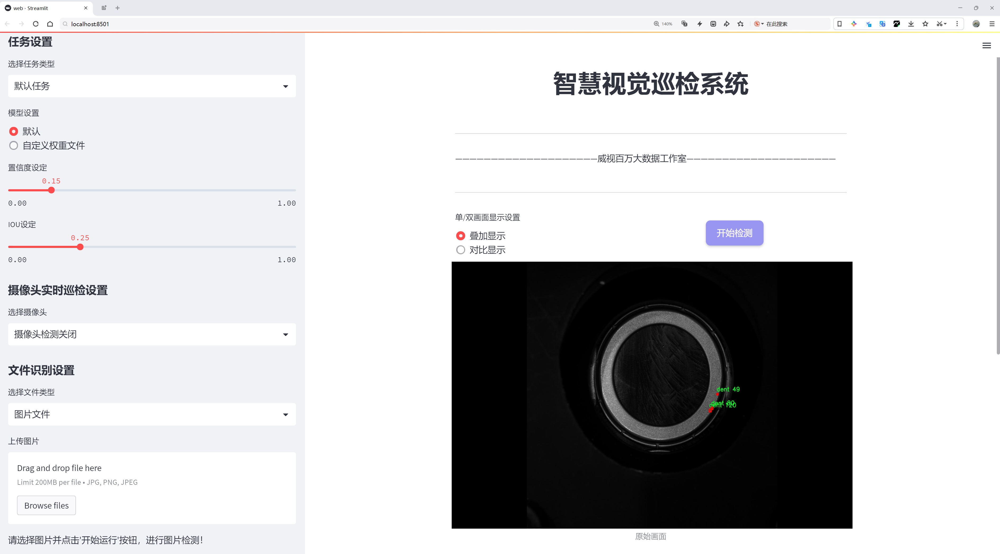
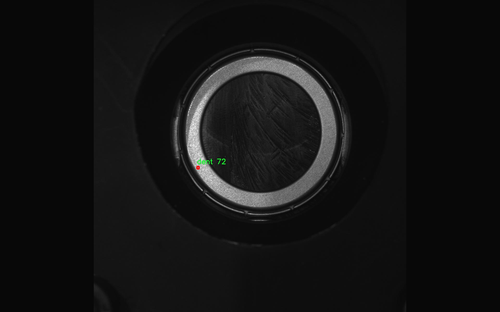
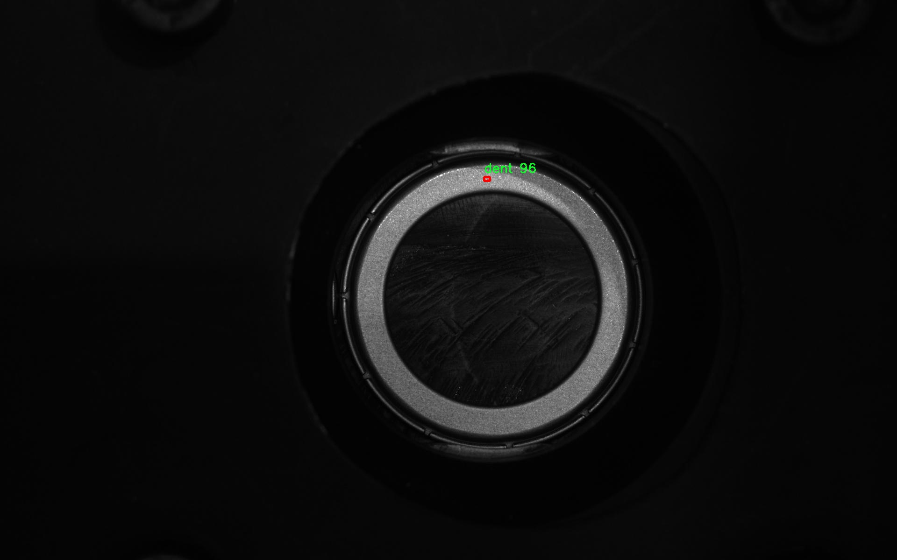
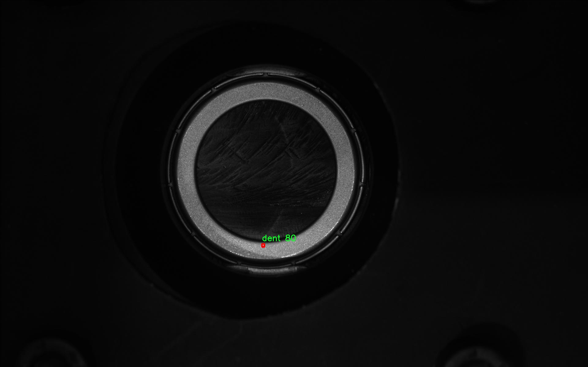
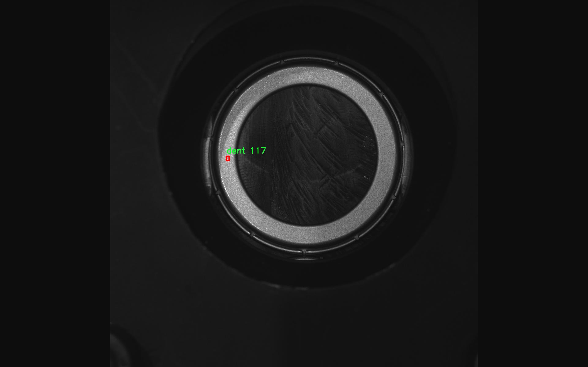

# 轴承表面缺陷检测检测系统源码分享
 # [一条龙教学YOLOV8标注好的数据集一键训练_70+全套改进创新点发刊_Web前端展示]

### 1.研究背景与意义

项目参考[AAAI Association for the Advancement of Artificial Intelligence](https://gitee.com/qunshansj/projects)

项目来源[AACV Association for the Advancement of Computer Vision](https://gitee.com/qunmasj/projects)

研究背景与意义

随着工业自动化和智能制造的迅速发展，机械设备的可靠性和安全性日益受到重视。轴承作为机械设备中至关重要的组成部分，其性能直接影响到设备的整体运行效率和寿命。轴承表面缺陷的存在不仅会导致设备故障，还可能引发严重的安全事故。因此，针对轴承表面缺陷的检测与识别显得尤为重要。传统的缺陷检测方法多依赖人工目视检查或简单的图像处理技术，这些方法不仅效率低下，而且容易受到人为因素的影响，导致漏检或误检的情况发生。

近年来，深度学习技术的迅猛发展为图像识别和目标检测领域带来了新的机遇。YOLO（You Only Look Once）系列算法以其高效的实时检测能力和较高的准确率，成为目标检测任务中的重要工具。YOLOv8作为该系列的最新版本，进一步提升了检测精度和速度，适用于各种复杂场景的目标检测任务。然而，针对特定行业的应用，尤其是轴承表面缺陷检测，现有的YOLOv8模型仍需进行针对性的改进和优化，以提高其在特定缺陷类型上的检测能力。

本研究旨在基于改进的YOLOv8模型，构建一个高效的轴承表面缺陷检测系统。我们将使用包含2300张图像的“manu_new_machine”数据集，该数据集涵盖了7种不同类型的缺陷，包括bs（表面划痕）、chip_mark（缺口标记）、curling_damage（卷曲损伤）、cut_piece（切割缺损）、dent（凹陷）、dr（钻孔缺陷）和out_piece（外部缺损）。这些缺陷类型的多样性为模型的训练和测试提供了丰富的样本，有助于提高模型的泛化能力和鲁棒性。

通过对YOLOv8模型的改进，我们将探索如何有效地利用数据集中的信息，优化特征提取和缺陷分类的过程。研究将重点关注如何通过数据增强、迁移学习等技术，提高模型在小样本情况下的学习能力。此外，我们还将考虑模型在实际应用中的实时性和准确性，确保其能够在工业生产环境中高效运行。

本研究的意义不仅在于提升轴承表面缺陷检测的技术水平，更在于推动智能制造领域的进步。通过实现高效、准确的缺陷检测系统，可以大幅降低生产过程中的人工成本，提高产品质量，延长设备的使用寿命，从而为企业带来可观的经济效益。同时，本研究也为深度学习在工业检测领域的应用提供了新的思路和方法，具有重要的理论价值和实际应用前景。综上所述，基于改进YOLOv8的轴承表面缺陷检测系统的研究，将为推动智能制造和工业自动化的发展贡献重要力量。

### 2.图片演示







##### 注意：由于此博客编辑较早，上面“2.图片演示”和“3.视频演示”展示的系统图片或者视频可能为老版本，新版本在老版本的基础上升级如下：（实际效果以升级的新版本为准）

  （1）适配了YOLOV8的“目标检测”模型和“实例分割”模型，通过加载相应的权重（.pt）文件即可自适应加载模型。

  （2）支持“图片识别”、“视频识别”、“摄像头实时识别”三种识别模式。

  （3）支持“图片识别”、“视频识别”、“摄像头实时识别”三种识别结果保存导出，解决手动导出（容易卡顿出现爆内存）存在的问题，识别完自动保存结果并导出到tempDir中。

  （4）支持Web前端系统中的标题、背景图等自定义修改，后面提供修改教程。

  另外本项目提供训练的数据集和训练教程,暂不提供权重文件（best.pt）,需要您按照教程进行训练后实现图片演示和Web前端界面演示的效果。

### 3.视频演示

[3.1 视频演示](https://www.bilibili.com/video/BV1yetQeUEus/)

### 4.数据集信息展示

##### 4.1 本项目数据集详细数据（类别数＆类别名）

nc: 7
names: ['bs', 'chip_mark', 'curling_damage', 'cut_piece', 'dent', 'dr', 'out_piece']


##### 4.2 本项目数据集信息介绍

数据集信息展示

在本研究中，我们使用了名为“manu_new_machine”的数据集，以训练和改进YOLOv8模型在轴承表面缺陷检测系统中的应用。该数据集专门针对工业制造过程中常见的轴承表面缺陷进行了精心构建，旨在提升缺陷检测的准确性和效率。数据集的设计考虑了多种实际应用场景，确保模型能够在真实环境中表现出色。

“manu_new_machine”数据集包含七个类别，分别为：bs（表面划痕）、chip_mark（缺口标记）、curling_damage（卷曲损伤）、cut_piece（切割片）、dent（凹痕）、dr（钻孔缺陷）和out_piece（外部缺陷）。这些类别涵盖了轴承表面可能出现的主要缺陷类型，能够为模型提供丰富的训练样本。每个类别的样本数量经过精心平衡，以确保模型在学习过程中不会偏向某一特定类别，从而提高整体检测性能。

在数据集的构建过程中，采用了多种数据采集技术，包括高分辨率图像采集和多角度拍摄，确保每个缺陷类别的样本具有足够的多样性和代表性。这种多样性不仅体现在缺陷的外观特征上，还包括不同的光照条件、背景干扰和表面纹理等因素，从而增强了模型的鲁棒性。此外，数据集中的每个样本都经过了精确的标注，确保每个缺陷的边界框和类别标签的准确性，这对于后续的模型训练至关重要。

在数据预处理阶段，我们对图像进行了标准化处理，以消除不同拍摄条件带来的影响。通过调整图像的亮度、对比度和饱和度，确保模型能够在各种环境下进行有效的特征提取。同时，数据增强技术也被广泛应用于数据集的构建中，包括随机裁剪、旋转、翻转等操作，以增加训练样本的多样性，从而提高模型的泛化能力。

通过使用“manu_new_machine”数据集，我们期望能够训练出一个高效的YOLOv8模型，使其在轴承表面缺陷检测任务中表现出色。该模型不仅能够准确识别和分类不同类型的缺陷，还能够在实时检测中保持高效的处理速度，满足工业生产对检测系统的高要求。随着工业自动化和智能制造的不断发展，轴承表面缺陷检测的准确性和效率将直接影响到产品的质量和生产效率，因此，构建一个高性能的检测系统显得尤为重要。

总之，“manu_new_machine”数据集为我们提供了一个坚实的基础，使得YOLOv8模型在轴承表面缺陷检测任务中能够充分发挥其潜力。通过不断优化和改进模型，我们希望能够为工业制造领域提供更为精准和高效的缺陷检测解决方案，推动智能制造的进一步发展。










### 5.全套项目环境部署视频教程（零基础手把手教学）

[5.1 环境部署教程链接（零基础手把手教学）](https://www.ixigua.com/7404473917358506534?logTag=c807d0cbc21c0ef59de5)


[5.2 安装Python虚拟环境创建和依赖库安装视频教程链接（零基础手把手教学）](https://www.ixigua.com/7404474678003106304?logTag=1f1041108cd1f708b01a)

### 6.手把手YOLOV8训练视频教程（零基础小白有手就能学会）

[6.1 手把手YOLOV8训练视频教程（零基础小白有手就能学会）](https://www.ixigua.com/7404477157818401292?logTag=d31a2dfd1983c9668658)

### 7.70+种全套YOLOV8创新点代码加载调参视频教程（一键加载写好的改进模型的配置文件）

[7.1 70+种全套YOLOV8创新点代码加载调参视频教程（一键加载写好的改进模型的配置文件）](https://www.ixigua.com/7404478314661806627?logTag=29066f8288e3f4eea3a4)

### 8.70+种全套YOLOV8创新点原理讲解（非科班也可以轻松写刊发刊，V10版本正在科研待更新）

由于篇幅限制，每个创新点的具体原理讲解就不一一展开，具体见下列网址中的创新点对应子项目的技术原理博客网址【Blog】：


[8.1 70+种全套YOLOV8创新点原理讲解链接](https://gitee.com/qunmasj/good)

### 9.系统功能展示（检测对象为举例，实际内容以本项目数据集为准）

图9.1.系统支持检测结果表格显示

  图9.2.系统支持置信度和IOU阈值手动调节

  图9.3.系统支持自定义加载权重文件best.pt(需要你通过步骤5中训练获得)

  图9.4.系统支持摄像头实时识别

  图9.5.系统支持图片识别

  图9.6.系统支持视频识别

  图9.7.系统支持识别结果文件自动保存

  图9.8.系统支持Excel导出检测结果数据


### 10.原始YOLOV8算法原理

原始YOLOv8算法原理

YOLOv8是YOLO系列中的最新版本，继承了YOLOv3和YOLOv5的优良传统，并在此基础上进行了多项创新和改进，使其在目标检测的精度和速度上都取得了显著的提升。YOLOv8的设计理念是为了满足不同应用场景的需求，因此提供了五种不同规模的模型：YOLOv8n、YOLOv8s、YOLOv8m、YOLOv8l和YOLOv8x。这些模型在网络深度和参数量上各有不同，能够在不同的计算资源和实时性要求下灵活应用。其中，YOLOv8n以其最小的参数量和最快的检测速度，成为了实时性要求较高场景的理想选择。

YOLOv8的网络结构可以分为四个主要部分：输入端、骨干网络、颈部网络和头部网络。输入端的设计引入了多种数据增强技术，包括马赛克增强、自适应锚框计算和自适应灰度填充等。这些技术不仅提高了模型的鲁棒性，还增强了其对不同场景的适应能力。特别是马赛克增强，通过将多张图像拼接在一起，能够有效提升模型对小目标的检测能力。

在骨干网络部分，YOLOv8采用了C2f模块和空间金字塔池化融合（SPPF）结构。C2f模块是YOLOv8的核心创新之一，它通过引入更多的分支和跨层连接，增强了梯度流的丰富性，从而提升了特征表示能力。这一设计灵感源自于YOLOv7的ELAN结构，C2f模块的引入使得网络在保持轻量化的同时，能够学习到更加复杂的特征表示。SPPF结构则通过多尺度特征的融合，进一步增强了网络对不同尺寸目标的检测能力。

颈部网络采用了路径聚合网络（PAN）结构，这一结构的设计目的是为了更好地融合来自不同尺度的特征信息。PAN结构通过上下采样和特征融合，能够有效提升模型对多尺度目标的检测性能。通过这一设计，YOLOv8能够在处理不同大小的目标时，保持较高的检测精度。

头部网络是YOLOv8的另一个重要创新点。与以往的耦合头结构不同，YOLOv8采用了解耦头结构，将分类和检测任务分开处理。这一设计使得模型在进行目标分类和边界框回归时，能够更专注于各自的任务，从而提升整体性能。此外，YOLOv8还引入了无锚框检测头，减少了锚框预测的数量，这不仅加速了非最大抑制（NMS）过程，还提高了模型的灵活性和适应性。

在损失计算方面，YOLOv8采用了新的标签分配策略，结合了Varifocal Loss和CIoULoss等多种损失函数。Varifocal Loss通过对正负样本进行不对称加权，提升了模型对高质量样本的关注度，从而有效提高了检测精度。CIoULoss则在边界框回归中考虑了重叠区域、中心点距离和长宽比等多个因素，使得边界框的预测更加精准。

YOLOv8的创新之处不仅体现在网络结构和损失函数的设计上，还包括其数据预处理策略。YOLOv8在训练过程中采用了多种数据增强手段，如混合增强、空间扰动和颜色扰动等，这些增强手段能够有效提升模型的泛化能力，使其在面对不同场景和条件时，依然能够保持较高的检测性能。

总的来说，YOLOv8在多个方面进行了创新和改进，使其在目标检测领域中具备了更强的竞争力。通过引入新的网络结构、优化损失计算、采用高效的数据增强策略，YOLOv8不仅提升了检测精度和速度，还增强了模型的灵活性和适应性。随着YOLOv8的发布，目标检测技术将迎来新的发展机遇，为各类应用场景提供更为高效和精准的解决方案。


### 11.项目核心源码讲解（再也不用担心看不懂代码逻辑）

#### 11.1 70+种YOLOv8算法改进源码大全和调试加载训练教程（非必要）\ultralytics\utils\callbacks\comet.py

以下是对给定代码的核心部分进行分析和详细注释的结果：

```python
# 导入必要的库和模块
from ultralytics.utils import LOGGER, RANK, SETTINGS, TESTS_RUNNING, ops
import os
from pathlib import Path

# 尝试导入Comet ML库并进行基本的设置检查
try:
    assert not TESTS_RUNNING  # 确保不是在pytest测试中
    assert SETTINGS['comet'] is True  # 确保Comet集成已启用
    import comet_ml
    assert hasattr(comet_ml, '__version__')  # 确保导入的包不是目录
except (ImportError, AssertionError):
    comet_ml = None  # 如果导入失败，则将comet_ml设置为None

# 定义一些辅助函数，用于获取环境变量的设置
def _get_comet_mode():
    """返回环境变量中设置的Comet模式，默认为'online'。"""
    return os.getenv('COMET_MODE', 'online')

def _get_comet_model_name():
    """返回环境变量中设置的模型名称，默认为'YOLOv8'。"""
    return os.getenv('COMET_MODEL_NAME', 'YOLOv8')

def _get_eval_batch_logging_interval():
    """获取评估批次日志记录间隔，默认为1。"""
    return int(os.getenv('COMET_EVAL_BATCH_LOGGING_INTERVAL', 1))

def _get_max_image_predictions_to_log():
    """获取要记录的最大图像预测数量。"""
    return int(os.getenv('COMET_MAX_IMAGE_PREDICTIONS', 100))

# 创建实验对象的函数
def _create_experiment(args):
    """确保在分布式训练中仅在单个进程中创建实验对象。"""
    if RANK not in (-1, 0):  # 仅在主进程中创建实验
        return
    try:
        comet_mode = _get_comet_mode()
        _project_name = os.getenv('COMET_PROJECT_NAME', args.project)
        experiment = comet_ml.OfflineExperiment(project_name=_project_name) if comet_mode == 'offline' else comet_ml.Experiment(project_name=_project_name)
        experiment.log_parameters(vars(args))  # 记录参数
    except Exception as e:
        LOGGER.warning(f'WARNING ⚠️ Comet安装但未正确初始化，未记录此运行。{e}')

# 记录混淆矩阵的函数
def _log_confusion_matrix(experiment, trainer, curr_step, curr_epoch):
    """将混淆矩阵记录到Comet实验中。"""
    conf_mat = trainer.validator.confusion_matrix.matrix  # 获取混淆矩阵
    names = list(trainer.data['names'].values()) + ['background']  # 获取类别名称
    experiment.log_confusion_matrix(
        matrix=conf_mat,
        labels=names,
        max_categories=len(names),
        epoch=curr_epoch,
        step=curr_step,
    )

# 记录图像的函数
def _log_images(experiment, image_paths, curr_step, annotations=None):
    """将图像记录到实验中，带有可选的注释。"""
    if annotations:
        for image_path, annotation in zip(image_paths, annotations):
            experiment.log_image(image_path, name=image_path.stem, step=curr_step, annotations=annotation)
    else:
        for image_path in image_paths:
            experiment.log_image(image_path, name=image_path.stem, step=curr_step)

# 训练结束时的回调函数
def on_train_end(trainer):
    """在训练结束时执行操作。"""
    experiment = comet_ml.get_global_experiment()  # 获取当前的Comet实验
    if not experiment:
        return

    metadata = _fetch_trainer_metadata(trainer)  # 获取训练元数据
    curr_epoch = metadata['curr_epoch']
    curr_step = metadata['curr_step']

    _log_confusion_matrix(experiment, trainer, curr_step, curr_epoch)  # 记录混淆矩阵
    experiment.end()  # 结束实验

# 注册回调函数
callbacks = {
    'on_train_end': on_train_end
} if comet_ml else {}
```

### 代码分析和注释说明：

1. **导入模块**：代码首先导入了必要的模块和库，包括Ultralytics的工具和Comet ML库。

2. **环境变量检查**：通过`try-except`块确保在导入Comet ML时不会出现错误，并且检查必要的环境变量设置。

3. **辅助函数**：定义了一些辅助函数来获取环境变量的值，这些值用于配置Comet实验的行为，例如实验模式、模型名称、日志记录间隔等。

4. **实验创建**：`_create_experiment`函数确保在分布式训练中只在主进程中创建Comet实验对象，并记录训练参数。

5. **记录混淆矩阵**：`_log_confusion_matrix`函数将训练过程中生成的混淆矩阵记录到Comet实验中，便于后续分析。

6. **记录图像**：`_log_images`函数用于将训练过程中生成的图像记录到Comet实验中，可以选择性地添加注释。

7. **训练结束回调**：`on_train_end`函数在训练结束时执行，记录混淆矩阵并结束Comet实验。

8. **回调注册**：最后，将回调函数注册到`callbacks`字典中，以便在训练过程中调用。

这些核心部分和注释提供了对代码的清晰理解，帮助开发者了解如何在YOLOv8训练过程中集成Comet ML进行实验跟踪和可视化。

这个文件是Ultralytics YOLOv8算法中的一个回调模块，主要用于与Comet.ml进行集成，以便在训练过程中记录和可视化模型的性能。文件中包含了一系列函数和回调，以支持模型训练的监控和评估。

首先，文件引入了一些必要的库和模块，包括日志记录器、设置和操作函数。接着，文件中定义了一些环境变量的获取函数，这些环境变量用于配置Comet的行为，比如实验模式、模型名称、评估批次日志记录间隔等。

在文件中，`_create_experiment`函数负责创建Comet实验对象，并在训练开始时记录一些参数和设置。为了确保在分布式训练中只创建一个实验实例，函数会检查当前进程的RANK值。

`_fetch_trainer_metadata`函数用于获取当前训练的元数据，包括当前的epoch、步骤和是否需要保存模型资产等信息。接下来的几个函数主要用于处理和格式化预测框和真实框的注释，以便在Comet中进行记录和可视化。

文件中还定义了一些日志记录函数，比如`_log_confusion_matrix`、`_log_images`和`_log_model`，这些函数负责将混淆矩阵、图像和模型信息记录到Comet实验中。

在训练的不同阶段，文件通过回调函数来执行特定的操作。例如，`on_pretrain_routine_start`在预训练开始时创建或恢复Comet实验，`on_train_epoch_end`在每个训练epoch结束时记录指标和保存图像，`on_fit_epoch_end`在每个fit epoch结束时记录模型资产，`on_train_end`在训练结束时执行清理和记录操作。

最后，文件通过一个字典将这些回调函数与特定的事件关联起来，以便在训练过程中自动调用。整体来看，这个文件的主要目的是为了方便用户在使用YOLOv8进行模型训练时，能够实时监控和记录训练过程中的各种信息，进而帮助用户更好地理解和优化模型性能。

#### 11.2 train.py

以下是经过简化并注释的核心代码部分：

```python
import random
import numpy as np
import torch.nn as nn
from ultralytics.data import build_dataloader, build_yolo_dataset
from ultralytics.engine.trainer import BaseTrainer
from ultralytics.models import yolo
from ultralytics.nn.tasks import DetectionModel
from ultralytics.utils import LOGGER, RANK
from ultralytics.utils.torch_utils import de_parallel, torch_distributed_zero_first

class DetectionTrainer(BaseTrainer):
    """
    基于检测模型的训练类，继承自BaseTrainer类。
    """

    def build_dataset(self, img_path, mode="train", batch=None):
        """
        构建YOLO数据集。

        参数:
            img_path (str): 包含图像的文件夹路径。
            mode (str): 模式，可以是'train'或'val'，用于自定义不同的增强方法。
            batch (int, optional): 批次大小，适用于'rect'模式。默认为None。
        """
        gs = max(int(de_parallel(self.model).stride.max() if self.model else 0), 32)
        return build_yolo_dataset(self.args, img_path, batch, self.data, mode=mode, rect=mode == "val", stride=gs)

    def get_dataloader(self, dataset_path, batch_size=16, rank=0, mode="train"):
        """构建并返回数据加载器。"""
        assert mode in ["train", "val"]
        with torch_distributed_zero_first(rank):  # 仅在DDP中初始化数据集*.cache一次
            dataset = self.build_dataset(dataset_path, mode, batch_size)
        shuffle = mode == "train"
        if getattr(dataset, "rect", False) and shuffle:
            LOGGER.warning("WARNING ⚠️ 'rect=True'与DataLoader的shuffle不兼容，设置shuffle=False")
            shuffle = False
        workers = self.args.workers if mode == "train" else self.args.workers * 2
        return build_dataloader(dataset, batch_size, workers, shuffle, rank)  # 返回数据加载器

    def preprocess_batch(self, batch):
        """对图像批次进行预处理，包括缩放和转换为浮点数。"""
        batch["img"] = batch["img"].to(self.device, non_blocking=True).float() / 255  # 将图像转换为浮点数并归一化
        if self.args.multi_scale:
            imgs = batch["img"]
            sz = (
                random.randrange(self.args.imgsz * 0.5, self.args.imgsz * 1.5 + self.stride)
                // self.stride
                * self.stride
            )  # 随机选择新的尺寸
            sf = sz / max(imgs.shape[2:])  # 计算缩放因子
            if sf != 1:
                ns = [
                    math.ceil(x * sf / self.stride) * self.stride for x in imgs.shape[2:]
                ]  # 计算新的形状
                imgs = nn.functional.interpolate(imgs, size=ns, mode="bilinear", align_corners=False)  # 进行插值
            batch["img"] = imgs
        return batch

    def set_model_attributes(self):
        """设置模型的属性，包括类别数量和名称。"""
        self.model.nc = self.data["nc"]  # 将类别数量附加到模型
        self.model.names = self.data["names"]  # 将类别名称附加到模型
        self.model.args = self.args  # 将超参数附加到模型

    def get_model(self, cfg=None, weights=None, verbose=True):
        """返回YOLO检测模型。"""
        model = DetectionModel(cfg, nc=self.data["nc"], verbose=verbose and RANK == -1)
        if weights:
            model.load(weights)  # 加载权重
        return model

    def plot_training_samples(self, batch, ni):
        """绘制带有注释的训练样本。"""
        plot_images(
            images=batch["img"],
            batch_idx=batch["batch_idx"],
            cls=batch["cls"].squeeze(-1),
            bboxes=batch["bboxes"],
            paths=batch["im_file"],
            fname=self.save_dir / f"train_batch{ni}.jpg",
            on_plot=self.on_plot,
        )
```

### 代码说明：
1. **DetectionTrainer类**：这是一个用于训练YOLO检测模型的类，继承自基础训练类`BaseTrainer`。
2. **build_dataset方法**：根据给定的图像路径和模式构建YOLO数据集。
3. **get_dataloader方法**：构建并返回数据加载器，支持分布式训练。
4. **preprocess_batch方法**：对输入的图像批次进行预处理，包括归一化和尺寸调整。
5. **set_model_attributes方法**：设置模型的类别数量和名称等属性。
6. **get_model方法**：返回一个YOLO检测模型，并可选择加载预训练权重。
7. **plot_training_samples方法**：绘制训练样本及其注释，便于可视化训练过程。

这个程序文件 `train.py` 是一个用于训练目标检测模型的脚本，主要基于 YOLO（You Only Look Once）模型。文件中定义了一个名为 `DetectionTrainer` 的类，它继承自 `BaseTrainer` 类，专门用于处理目标检测任务的训练过程。

在这个类中，首先定义了一个 `build_dataset` 方法，用于构建 YOLO 数据集。该方法接收图像路径、模式（训练或验证）和批次大小作为参数。它通过调用 `build_yolo_dataset` 函数来创建数据集，支持不同模式下的增强操作。

接下来，`get_dataloader` 方法用于构建数据加载器。它会根据传入的模式（训练或验证）来初始化数据集，并根据需要设置数据加载的随机打乱。该方法还考虑了分布式训练的情况，以确保数据集的缓存只初始化一次。

`preprocess_batch` 方法负责对每个批次的图像进行预处理，包括缩放和转换为浮点数格式。它还支持多尺度训练，通过随机选择图像的大小来增强模型的鲁棒性。

`set_model_attributes` 方法用于设置模型的属性，包括类别数量和类别名称。这些信息会被附加到模型中，以便在训练过程中使用。

`get_model` 方法返回一个 YOLO 检测模型的实例，可以选择加载预训练的权重。

`get_validator` 方法返回一个用于模型验证的 `DetectionValidator` 实例，包含损失名称的定义，以便在验证过程中记录和分析模型的性能。

`label_loss_items` 方法用于返回带有标签的训练损失项字典，这对于目标检测任务是必要的，因为它需要跟踪多个损失项。

`progress_string` 方法返回一个格式化的字符串，显示训练进度，包括当前的轮次、GPU 内存使用情况、损失值、实例数量和图像大小等信息。

`plot_training_samples` 方法用于绘制训练样本及其注释，以便可视化训练过程中的数据。

最后，`plot_metrics` 和 `plot_training_labels` 方法分别用于绘制训练过程中的指标和创建带标签的训练图，帮助用户更好地理解模型的训练效果。

总体来说，这个文件提供了一个完整的框架，用于训练 YOLO 模型，处理数据集的构建、数据加载、模型训练和结果可视化等任务。

#### 11.3 ui.py

```python
import sys
import subprocess

def run_script(script_path):
    """
    使用当前 Python 环境运行指定的脚本。

    Args:
        script_path (str): 要运行的脚本路径

    Returns:
        None
    """
    # 获取当前 Python 解释器的路径
    python_path = sys.executable

    # 构建运行命令
    command = f'"{python_path}" -m streamlit run "{script_path}"'

    # 执行命令
    result = subprocess.run(command, shell=True)
    if result.returncode != 0:
        print("脚本运行出错。")


# 实例化并运行应用
if __name__ == "__main__":
    # 指定您的脚本路径
    script_path = "web.py"  # 这里可以直接指定脚本名称

    # 运行脚本
    run_script(script_path)
```

### 代码注释说明：

1. **导入模块**：
   - `import sys`：导入系统相关的模块，用于获取当前 Python 解释器的路径。
   - `import subprocess`：导入子进程模块，用于在 Python 中执行外部命令。

2. **定义函数 `run_script`**：
   - 该函数接受一个参数 `script_path`，表示要运行的 Python 脚本的路径。
   - 使用 `sys.executable` 获取当前 Python 解释器的完整路径。
   - 构建一个命令字符串，使用 `streamlit` 模块运行指定的脚本。
   - 使用 `subprocess.run` 执行构建的命令，并通过 `shell=True` 允许在 shell 中执行命令。
   - 检查命令执行的返回码，如果不为 0，表示执行出错，打印错误信息。

3. **主程序入口**：
   - 使用 `if __name__ == "__main__":` 确保只有在直接运行该脚本时才会执行以下代码。
   - 指定要运行的脚本路径 `script_path`，这里直接使用 `"web.py"`。
   - 调用 `run_script` 函数，传入脚本路径以执行该脚本。

这个程序文件名为 `ui.py`，其主要功能是通过当前的 Python 环境来运行一个指定的脚本。程序的实现过程如下：

首先，程序导入了几个必要的模块，包括 `sys`、`os` 和 `subprocess`。其中，`sys` 模块用于访问与 Python 解释器相关的变量和函数，`os` 模块提供了与操作系统交互的功能，而 `subprocess` 模块则用于生成新的进程、连接到它们的输入/输出/错误管道，并获取它们的返回码。

接着，程序从 `QtFusion.path` 模块中导入了 `abs_path` 函数，这个函数的作用是获取文件的绝对路径。

在 `run_script` 函数中，程序接受一个参数 `script_path`，这个参数是要运行的脚本的路径。函数内部首先获取当前 Python 解释器的路径，并将其存储在 `python_path` 变量中。然后，程序构建了一个命令字符串，该命令使用 `streamlit` 模块来运行指定的脚本。`streamlit` 是一个用于构建数据应用的库。

接下来，程序使用 `subprocess.run` 方法执行构建好的命令。这个方法会在一个新的 shell 中运行命令，并等待其完成。运行完成后，程序检查返回码，如果返回码不为 0，表示脚本运行出错，程序会输出一条错误信息。

最后，在 `if __name__ == "__main__":` 这一部分，程序指定了要运行的脚本路径，这里是通过 `abs_path` 函数获取的 `web.py` 的绝对路径。然后，调用 `run_script` 函数来执行这个脚本。

总的来说，这个程序的主要功能是为用户提供一个简单的接口，以便在当前 Python 环境中运行指定的 Streamlit 脚本，并处理可能出现的错误。

#### 11.4 70+种YOLOv8算法改进源码大全和调试加载训练教程（非必要）\ultralytics\models\fastsam\val.py

```python
# 导入必要的模块
from ultralytics.models.yolo.segment import SegmentationValidator
from ultralytics.utils.metrics import SegmentMetrics

class FastSAMValidator(SegmentationValidator):
    """
    自定义验证类，用于在Ultralytics YOLO框架中进行快速SAM（Segment Anything Model）分割。

    该类扩展了SegmentationValidator类，专门定制了快速SAM的验证过程。它将任务设置为'分割'，并使用SegmentMetrics进行评估。此外，为了避免在验证过程中出现错误，禁用了绘图功能。
    """

    def __init__(self, dataloader=None, save_dir=None, pbar=None, args=None, _callbacks=None):
        """
        初始化FastSAMValidator类，将任务设置为'分割'，并将指标设置为SegmentMetrics。

        参数：
            dataloader (torch.utils.data.DataLoader): 用于验证的数据加载器。
            save_dir (Path, optional): 保存结果的目录。
            pbar (tqdm.tqdm): 用于显示进度的进度条。
            args (SimpleNamespace): 验证器的配置。
            _callbacks (dict): 用于存储各种回调函数的字典。

        注意：
            在此类中禁用了ConfusionMatrix和其他相关指标的绘图，以避免错误。
        """
        # 调用父类的初始化方法
        super().__init__(dataloader, save_dir, pbar, args, _callbacks)
        # 设置任务类型为'分割'
        self.args.task = 'segment'
        # 禁用绘图功能以避免错误
        self.args.plots = False  
        # 初始化分割指标
        self.metrics = SegmentMetrics(save_dir=self.save_dir, on_plot=self.on_plot)
```

### 代码核心部分说明：
1. **类定义**：`FastSAMValidator`类继承自`SegmentationValidator`，用于快速SAM分割的自定义验证。
2. **初始化方法**：`__init__`方法中，设置了验证所需的参数，包括数据加载器、保存目录、进度条、配置参数和回调函数。
3. **任务和绘图设置**：将任务类型设置为'分割'，并禁用绘图功能，以避免在验证过程中出现错误。
4. **指标初始化**：使用`SegmentMetrics`类来初始化分割指标，用于评估验证结果。

这个程序文件是一个用于快速SAM（Segment Anything Model）分割的自定义验证类，名为`FastSAMValidator`，它继承自Ultralytics YOLO框架中的`SegmentationValidator`类。该类的主要目的是在YOLO框架中实现特定于快速SAM的验证过程。

在类的文档字符串中，详细说明了其功能和属性。`FastSAMValidator`类设置了任务为“分割”，并使用`SegmentMetrics`进行评估。此外，为了避免在验证过程中出现错误，该类禁用了绘图功能。

构造函数`__init__`用于初始化`FastSAMValidator`类。它接受多个参数，包括数据加载器`dataloader`、结果保存目录`save_dir`、进度条对象`pbar`、额外的配置参数`args`以及回调函数列表`_callbacks`。在构造函数中，首先调用父类的构造函数进行初始化，然后将任务类型设置为“segment”，并禁用绘图功能，以避免在验证过程中可能出现的错误。最后，初始化`metrics`属性为`SegmentMetrics`实例，用于后续的评估和结果记录。

整体来看，这个文件实现了一个针对快速SAM的分割验证工具，简化了验证过程并确保在评估时不会出现不必要的错误。

#### 11.5 code\ultralytics\models\yolo\__init__.py

以下是保留的核心代码部分，并附上详细的中文注释：

```python
# 导入Ultralytics YOLO模型的相关功能
from ultralytics.models.yolo import classify, detect, obb, pose, segment

# 从当前模块导入YOLO类
from .model import YOLO

# 定义模块的公开接口，包含分类、检测、目标边界框、姿态估计和分割等功能
__all__ = "classify", "segment", "detect", "pose", "obb", "YOLO"
```

### 代码注释说明：

1. **导入模型功能**：
   - `from ultralytics.models.yolo import classify, detect, obb, pose, segment`：从Ultralytics库中导入YOLO模型的多个功能模块，包括分类（classify）、检测（detect）、目标边界框（obb）、姿态估计（pose）和图像分割（segment）。这些功能是YOLO模型的核心应用。

2. **导入YOLO类**：
   - `from .model import YOLO`：从当前模块的`model`文件中导入YOLO类，这个类可能包含YOLO模型的具体实现和方法。

3. **定义公开接口**：
   - `__all__ = "classify", "segment", "detect", "pose", "obb", "YOLO"`：定义模块的公开接口，指定在使用`from module import *`时可以导入的名称。这有助于控制模块的可见性，确保用户只访问到预期的功能。

这个程序文件是Ultralytics YOLO模型的初始化文件，文件名为`__init__.py`，它的主要作用是定义模块的公共接口。首先，文件顶部的注释说明了这是Ultralytics YOLO项目的一部分，并且使用了AGPL-3.0许可证。

接下来，文件通过`from`语句导入了几个功能模块，包括`classify`（分类）、`detect`（检测）、`obb`（有向边界框）、`pose`（姿态估计）和`segment`（分割）。这些模块提供了YOLO模型的不同功能，允许用户进行图像分类、目标检测、姿态估计等操作。

此外，文件还从同一目录下的`model`模块中导入了`YOLO`类，这个类可能是YOLO模型的核心实现，负责模型的初始化和运行。

最后，`__all__`变量定义了模块的公共接口，列出了可以被外部导入的名称。这意味着当用户使用`from ultralytics.models.yolo import *`时，只会导入`classify`、`segment`、`detect`、`pose`、`obb`和`YOLO`这几个名称，而不会导入其他未列出的内容。这种做法有助于控制模块的命名空间，避免名称冲突。

总体而言，这个文件为YOLO模型的使用提供了一个简洁的接口，方便用户调用不同的功能模块。

#### 11.6 70+种YOLOv8算法改进源码大全和调试加载训练教程（非必要）\ultralytics\models\yolo\pose\__init__.py

以下是代码中最核心的部分，并附上详细的中文注释：

```python
# 导入必要的模块
from .predict import PosePredictor  # 导入姿态预测器类
from .train import PoseTrainer      # 导入姿态训练器类
from .val import PoseValidator       # 导入姿态验证器类

# 定义模块的公开接口，只有这些类可以被外部访问
__all__ = 'PoseTrainer', 'PoseValidator', 'PosePredictor'
```

### 注释说明：
1. **导入模块**：
   - `from .predict import PosePredictor`：从当前包的 `predict` 模块中导入 `PosePredictor` 类，该类用于进行姿态预测。
   - `from .train import PoseTrainer`：从当前包的 `train` 模块中导入 `PoseTrainer` 类，该类用于训练姿态模型。
   - `from .val import PoseValidator`：从当前包的 `val` 模块中导入 `PoseValidator` 类，该类用于验证姿态模型的性能。

2. **定义公开接口**：
   - `__all__` 是一个特殊变量，用于定义当使用 `from module import *` 语句时，哪些名称是可以被导入的。在这里，只有 `PoseTrainer`、`PoseValidator` 和 `PosePredictor` 这三个类会被导出，其他未列出的名称将不会被导入。这有助于控制模块的可见性和避免命名冲突。

这个文件是一个Python模块的初始化文件，属于Ultralytics YOLO项目的一部分，主要用于姿态估计（Pose Estimation）相关的功能。文件的第一行是一个注释，表明该项目使用的是AGPL-3.0许可证，并且包含了Ultralytics YOLO的标志。

接下来的几行代码从当前目录下导入了三个类：`PosePredictor`、`PoseTrainer`和`PoseValidator`。这些类分别用于姿态预测、训练和验证。通过导入这些类，用户可以在其他模块中直接使用它们，而无需知道它们的具体实现细节。

最后，`__all__`变量定义了当使用`from module import *`语句时，哪些名称会被导入。在这里，`PoseTrainer`、`PoseValidator`和`PosePredictor`被列入了`__all__`，这意味着它们是该模块的公共接口，用户可以直接使用这些类进行姿态估计的相关操作。

总的来说，这个文件的主要作用是组织和暴露姿态估计相关的功能，使得其他模块可以方便地进行调用和使用。

### 12.系统整体结构（节选）

### 整体功能和构架概括

该项目是一个基于YOLOv8的目标检测和分割框架，包含了多种算法改进和训练、验证、推理的工具。项目结构清晰，模块化设计使得不同功能可以独立开发和维护。主要功能包括目标检测、姿态估计、图像分割、模型训练和验证，以及与外部工具（如Comet.ml）集成以进行实验监控和结果可视化。

项目的核心构架包括：
- **模型模块**：实现YOLO及其变种的核心算法，支持目标检测、姿态估计和图像分割。
- **训练和验证模块**：提供训练和验证过程的实现，支持数据加载、预处理和模型评估。
- **工具模块**：包含各种实用工具，如回调函数、数据处理、可视化等。
- **用户界面模块**：提供与用户交互的界面，方便用户进行操作和查看结果。

### 文件功能整理表

| 文件路径                                                                                     | 功能描述                                                         |
|----------------------------------------------------------------------------------------------|------------------------------------------------------------------|
| `ultralytics/utils/callbacks/comet.py`                                                      | 与Comet.ml集成，记录和可视化训练过程中的模型性能和参数。       |
| `train.py`                                                                                  | 定义了目标检测模型的训练过程，包括数据集构建、模型初始化等。   |
| `ui.py`                                                                                     | 提供一个接口，用于在当前Python环境中运行指定的Streamlit脚本。   |
| `ultralytics/models/fastsam/val.py`                                                         | 实现快速SAM的验证功能，继承自SegmentationValidator。           |
| `ultralytics/models/yolo/__init__.py`                                                      | 初始化YOLO模型模块，导入分类、检测、姿态估计等功能模块。       |
| `ultralytics/models/yolo/pose/__init__.py`                                                 | 初始化姿态估计模块，导入PosePredictor、PoseTrainer和PoseValidator。 |
| `ui_style.py`                                                                                | 定义用户界面的样式和布局，提供可视化组件的样式设置。           |
| `ultralytics/nn/extra_modules/rep_block.py`                                               | 实现额外的神经网络模块，可能用于模型的特定结构或功能。         |
| `ultralytics/models/sam/modules/tiny_encoder.py`                                           | 实现Tiny Encoder模块，可能用于图像分割或特征提取。             |
| `ultralytics/engine/predictor.py`                                                           | 定义模型的推理过程，处理输入数据并生成预测结果。               |
| `ultralytics/utils/instance.py`                                                             | 提供实例处理的工具函数，可能用于数据处理或模型管理。           |
| `ultralytics/models/sam/__init__.py`                                                       | 初始化SAM模块，导入相关的分割功能和类。                         |
| `ultralytics/nn/backbone/EfficientFormerV2.py`                                             | 实现EfficientFormerV2模型，可能用于特征提取或作为主干网络。    |

这个表格总结了每个文件的主要功能，展示了项目的模块化设计和功能分布。

注意：由于此博客编辑较早，上面“11.项目核心源码讲解（再也不用担心看不懂代码逻辑）”中部分代码可能会优化升级，仅供参考学习，完整“训练源码”、“Web前端界面”和“70+种创新点源码”以“13.完整训练+Web前端界面+70+种创新点源码、数据集获取”的内容为准。

### 13.完整训练+Web前端界面+70+种创新点源码、数据集获取


# [下载链接：https://mbd.pub/o/bread/ZpuXlJhr](https://mbd.pub/o/bread/ZpuXlJhr)